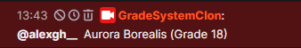
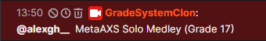

# Commands
#### Anything in square brackets are the options you choose from when using the command.
| Name        | First Parameter           | Second Parameter           | Description                                                        |
| ----------- | ------------------------- | -------------------------- | ------------------------------------------------------------------ |
| gs!search   | songname                  | None                       | Search for a song in the bot's database                            |
| gs!random   | [grade/category]          | gradenumber/category       | Randomly search for a song in the bot's database                   |

# Search

### Example
```
gs!search Megalodon
```


# Random
#### Comes with 2 sub commands (grade, category). Right now, you can choose from 5 categories to randomise. The categories are: Variety, Chording, Strumming, Tapping, Consistency

### Examples

```
gs!random grade 18
```
```
gs!random category Tapping
```


